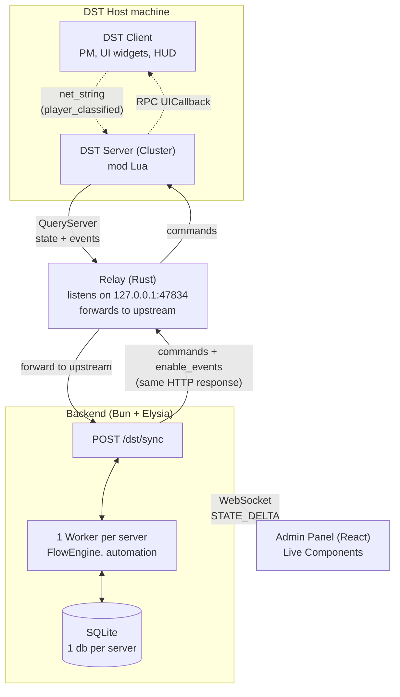

# CLAUDE.md

This file provides guidance to Claude Code (claude.ai/code) when working with code in this repository.

## Project Overview

**DSTP** — Don't Starve Together Panel. A web-based admin panel for DST servers with visual flow automation. Consists of a DST Lua mod (HTTP polling bridge) and a FluxStack full-stack app (Bun + Elysia + React).

**Scope note:** DSTP is a control/automation panel — NOT a mod compiler. Flows run on the backend and send commands to the DST server. We do NOT compile flows into Lua scripts.

**Sandbox constraint:** DST's Lua `TheSim:QueryServer` has a hardcoded whitelist that only allows `127.0.0.1` and `localhost`. This was confirmed by Klei in their 2025 mod API thread. There is NO bypass via Lua, modinfo, DNS trick, or Workshop signing — the check is a textual string match on the URL before DNS resolution. To host DSTP centrally (one backend for many DST servers), each DST host must run the **relay** (a tiny ~2MB native Rust HTTP forwarder) on their machine that listens on 127.0.0.1 and proxies to the central backend.

**The relay lives in a separate public repo:** [`MarcosBrendonDePaula/dstp-relay`](https://github.com/MarcosBrendonDePaula/dstp-relay) (Rust). It is NOT in this repo. Its release binaries (linux/windows/macos) are published there, and the panel's landing page fetches them live from the GitHub Releases API of that repo. The relay pulls its upstream config from `relay-config.json` in the dstp-relay repo at startup (`DSTP_ENV=prod` → `https://dstp.marcosbrendon.com`, `dev` → local).

## Specs — READ BEFORE working on UI or client/server code

`DST_MOD/specs/` holds hard-won technical knowledge that is NOT obvious from the code and cost real debugging time to discover. **Check the relevant spec first** — re-discovering these is expensive:
- `DST_MOD/specs/dst-client-constraints.md` — what the DST client can/can't see (mob health is NOT replicated, `onhitother`/`onattackother` are server-only, `net_string` holds one value so per-frame UI commands must be coalesced, HUD coordinate space). The "why it didn't work" doc.
- `DST_MOD/specs/ui-by-nodes.md` — building in-game UI from flows: UI Builder, the generic renderer (`ui_set`/`callback`/tabs/follow-entity), shops, live HUDs. Principle: a new UI needing new Lua means a missing generic prop/action.
- `DST_MOD/specs/ui-system.md` — full UI tree contract (node types, props, actions, events).
- `DST_MOD/specs/dynamic-data-bindings.md` — the binding system that replicates server-only data (mob health, etc.) to the client. Gate netvars by `inst.prefab` ONLY (tags/replicas/components desync → crash).
- `DST_MOD/specs/data-catalog.md` — which data is worth replicating (implemented + candidates: player HP, mob combat state, structure timers, fuel). Rule: add a source only when a concrete UI consumes it.

## Architecture



The **relay** is required because the DST Lua sandbox only allows
`TheSim:QueryServer` to reach `127.0.0.1`/`localhost` — it listens on loopback and
forwards to the backend (local in dev via `relay-config.json`, remote in prod). One
HTTP cycle of `/dst/sync` carries both directions: the game POSTs state + events and
the backend's response carries the queued commands + event categories to enable. The
panel talks to the backend over WebSocket (Live Components), never to the game directly.

Two separate codebases in one repo:

### DST Mod (Lua) — lives in `DST_MOD/`
- `DST_MOD/modinfo.lua` — mod config with event categories + server settings
- `DST_MOD/modmain.lua` — entry point, `net_string` channels on `player_classified` (_dstp_pm, _dstp_ui), Tab scoreboard button, lazy-loading UIWidgets
- `DST_MOD/scripts/dstp/client.lua` — HTTP bridge (~1400 lines). Polling, 40+ commands, event listeners, debounce
- `DST_MOD/scripts/dstp/ui_widgets.lua` — client-side widget renderer (notification/label/panel/button/progress_bar)
- `DST_MOD/scripts/dstp/rules_engine.lua` — client-side interpreter for declarative `when/do` rules pushed from the backend
- `DST_MOD/scripts_extracted/` — vanilla DST scripts extracted for reference (git-ignored, not part of the mod)

Key constraints:
- DST Lua sandbox: no sockets, no FFI, no threads. Only HTTP via `TheSim:QueryServer(url, callback, method, body)`
- `GLOBAL` only available in `modmain.lua` scope — modules loaded via `require()` must receive it via Init()
- DST uses **strict mode** — all variables must be declared before use
- `local function` in Lua is only visible AFTER the declaration line — order matters. Use forward declarations at module top
- Client-side: `pcall` blocked in mod env, use `GLOBAL.pcall`
- Client-side: entities have `replica`, NOT `components` (only server has components)

### FluxStack Frontend (TypeScript)
- `frontend/` — FluxStack app (Bun + Elysia + React 19 + Vite)
- Live Components for real-time server↔client sync via WebSocket
- SQLite via `bun:sqlite` + Drizzle ORM, one DB file per DST server in `data/`

Key files:
- `app/server/live/LiveDSTP.ts` — singleton Live Component, flat state keys for efficient STATE_DELTA
- `app/server/live/LiveAutomation.ts` — flow engine with stateful execution, Wait/Merge support
- `app/server/live/FlowAnalyzer.ts` — graph analysis: simple vs stateful flows, trigger→wait mapping
- `app/server/live/WorkflowInstanceStore.ts` — pending Wait node instances (on globalThis, survives HMR)
- `app/server/services/DSTStateStore.ts` — in-memory cache (players, shards, command queues)
- `app/server/routes/dst.routes.ts` — POST /api/dst/sync (DST game calls this)
- `app/server/db/` — Drizzle schema, repositories (FlowRepository, AutomationLogRepository, FlowMemoryRepository, etc)
- `app/server/live/nodes/` — backend node registry + `NodeRunContext`/`NodeHandler` contract (see **Node Module System**)
- `app/shared/automation/nodes/` — the node modules (one folder per type: meta/ui/exec)
- `app/client/src/live/DSTPanel.tsx` — main admin panel UI
- `app/client/src/automation/` — React Flow editor, node registry, NodeDetailPanel modal
- `app/server/services/SyncRecorder.ts` + `services/replay.ts` — dev tool: record real `/dst/sync` traffic and replay it against the engine (`bun run scripts/replay.ts`)

## Commands

```bash
# Development
cd frontend && bun run dev          # Start full-stack dev server (port 3000)

# TypeScript
cd frontend && bunx tsc --noEmit    # Type check

# Database
cd frontend && bun run db:generate  # Generate migration from schema changes
cd frontend && bun run db:studio    # Open Drizzle Studio

# Lua syntax check
bun -e "require('luaparse').parse(require('fs').readFileSync('DST_MOD/scripts/dstp/client.lua','utf8'),{luaVersion:'5.1'})"

# Copy mod to DST (do this after any Lua change)
cp DST_MOD/scripts/dstp/*.lua "E:/SteamLibrary/steamapps/common/Don't Starve Together/mods/DSTP/scripts/dstp/"
cp DST_MOD/modinfo.lua DST_MOD/modmain.lua "E:/SteamLibrary/steamapps/common/Don't Starve Together/mods/DSTP/"
```

## DST Modding Tools (Klei)

Klei's official **Don't Starve Mod Tools** are installed at:
`C:\Program Files (x86)\Steam\steamapps\common\Don't Starve Mod Tools`

- `ModUploader.exe` — uploads the mod to the Steam Workshop.
- `mod_tools/autocompiler.exe` — auto-compiles assets (PNG → KTEX `.tex`, anims, etc).
- `mod_tools/compiler_scripts/image_build.py` — the PNG→`.tex` converter (uses the
  bundled Python 2.7 + `klei.textureconverter`). Image dimensions must be multiples of 4.
- `mods/ktech/` (in the DST install) — ktech source, an alternative PNG↔TEX converter.

**Mod icon:** source art in `sources_raw/icon.png` (book + automation flow + control
panel, DST gothic style). Converted to `DST_MOD/modicon.tex` (+ `modicon.xml` atlas)
and wired in `modinfo.lua` via `icon`/`icon_atlas`.

**Steam Workshop:** published as ID `3737234840`
(https://steamcommunity.com/sharedfiles/filedetails/?id=3737234840). DST does NOT
store the id in `modinfo.lua` — the mod↔Workshop link lives in the ModUploader.
To update the Workshop entry, re-select DSTP in `ModUploader.exe` and re-upload;
bump `version` in `modinfo.lua` and add a `DST_MOD/CHANGELOG.md` entry first.

## Node Types

Each node is a **module** (one folder) — see **Node Module System** below.

| Node | Purpose |
|------|---------|
| `trigger` | Event-based entry point (40+ DST events across 11 categories) |
| `webhook` | Entry point fired by an inbound HTTP request (`POST /api/webhook/:serverId/:webhookId`), with optional per-node token + method |
| `condition` | Binary branch (true/false). Operators: equals, not_equals, greater_than, less_than, contains, **starts_with**, **ends_with**, exists |
| `switch` | Route by value: N exact-value cases → `case_<i>` handles, else `default` |
| `filter` | Stop the flow unless a condition passes (single output, halts on fail) |
| `foreach` | Iterate a list: run the `each` branch per item (`{{loop.item}}`/`{{loop.index}}`) then `done`. Capped at 40 items |
| `action` | Game action (respawn, heal, kick, tp, spawn_prefab, etc — 50+ subtypes via `action_type`) |
| `delay` | Wait N ms before continuing (capped at 1h) |
| `http_request` | External HTTP call (GET/POST with templates) |
| `set_variable` | Store custom key-value in context |
| `transform` | Safe value ops without the `script` RCE: upper/lower/trim/length/number/round, add/sub/mul/div, json parse/stringify |
| `random` | Pick a random list item or integer in [min,max] |
| `log` | Write a template-resolved, secret-masked debug line to the server log |
| `script` | JavaScript via `new Function()` (admin-only, runs in Node) |
| `get_player` | Fetch player data by userid (health, hunger, sanity, position, inventory, **admin**) |
| `find_player` | Search player by name (partial, strips command prefixes like `/tp`, `#tp`) |
| `memory` | Persistent key-value per flow (SQLite) |
| `wait` | Multi-trigger merge: waits for N branches, 3 correlation modes, timeout support |
| `ai_agent` | LLM agent (Vercel AI SDK). Nodes wired to its `tools` handle become callable tools; agentic loop (`stopWhen: stepCountIs`). See **AI Agent Node** below. |
| `ai_memory` | The AI's own key/value store, used as a tool by `ai_agent` (save/get/list/delete, free-form key). |
| `ui_*` | In-game UI: `ui_builder`, `ui_panel`, `ui_menu`, `ui_rule`, and primitives (`ui_col/row/tabs/text/icon/button/bar/spacer`) |

All nodes support `alias` for friendly context keys (`{{myAlias.field}}` instead of `{{node_id.field}}`).

## Node Module System

Every flow node is a **self-contained module = one folder** under
`frontend/app/shared/automation/nodes/<category>/<subcategory>/<type>/`:

```
<type>/
  meta.ts   # NodeMeta (SHARED, client+server): type, icon, color, category,
            #   defaults, outputSchema, aiDescription/aiParamDescriptions, flow
            #   flags (isTrigger/pausable). ZERO runtime deps (no React, no sqlite).
  ui.tsx    # export const ui — the React canvas component (FRONTEND only).
  exec.ts   # export const handler — the execution handler (BACKEND only).
            #   Absent for triggers/wait (they don't run via the dispatcher).
```

**Adding a node = create the folder + one import line in each registry.** No more
hunting ~13 scattered edit points. The registries:
- `app/server/live/nodes/registry.ts` — imports `meta` + `exec` (handler)
- `app/client/src/automation/nodes/registry.ts` — imports `meta` + `ui`

Registration is **explicit static import**, NOT a glob: the backend ships as one
bundled `dist/index.js`, so runtime FS globs (`Bun.Glob`) or `import.meta.glob`
(unsupported by Bun) would break in production. Static imports are bundle-safe.

**Bundle isolation:** `meta.ts` is the only file imported by BOTH sides. The
registries import `meta`+`ui` (client) and `meta`+`exec` (server) by exact
filename, so `ui.tsx` (React) never reaches the backend bundle and `exec.ts`
(bun:sqlite) never reaches the frontend — even though all three live in one folder.

**Everything derives from the registry** (no hand-maintained per-type lists):
`nodeTypes`, the palette catalog, create-defaults, output schemas, minimap colors,
the detail-modal config editor, FlowAnalyzer's isTrigger/pausable flags.

### Execution dispatch (`FlowEngine.processNode`)
`processNode` is a **dispatcher**: loop-guard → `wait` early-return → registry
dispatch. The handler receives a `NodeRunContext` (injects `resolve`, `param`,
`setContext`, `pushCommand`, `findPlayerInServer`, `followOutEdges`,
`executeHttpRequest`/`Script`, `runFlowAction`, `buildUITree`, `executeAIAgent`,
`log`, etc.) and returns one of:
- `'continue'` — engine traces the node, then follows ALL out-edges
- `'stop'` — traces, does NOT follow edges (`ui_panel` consumes children)
- `{ followEdges: filterFn }` — traces, then follows only matching edges
  (`condition` true/false, `switch` cases, `foreach` each/done)
- `{ wait: FlowNode }` — bubble a paused wait node up

Heavy helpers stay in `FlowEngine` and are injected — handlers stay small.

**`wait` is the lone exception OUTSIDE the registry**: its stateful pause
(`executeStatefulBranch` + `WorkflowInstanceStore`) lives in the orchestrator, not
a handler. Triggers (`trigger`/`webhook`) have no `exec` — they're entry points
matched in `evaluateEvent`.

### The detail modal reuses each node's `ui.tsx`
`NodeDetailPanel` renders the node's own `ui.tsx` (via a `ConfigOnlyContext` that
makes `BaseNode` emit just the fields) — single source of truth, so a new node's
config form works with zero modal edits. The modal renders OUTSIDE `<ReactFlow>`,
so `ui.tsx` uses the `useNodeDataUpdater()` hook (context updater in the modal,
`useReactFlow().updateNodeData` on the canvas) instead of `useReactFlow` directly.

### AI tool descriptions live on the node
`meta.aiDescription` / `meta.aiParamDescriptions` document a node for the
`ai_agent` (replacing the old central `ACTION_DESCRIPTIONS` map) — each node that
can be wired as a tool describes itself.

## AI Agent Node

`ai_agent` runs an LLM agent whose **tools are the nodes wired into its `tools` input handle** (left side). The model picks a tool, fills its params, and the engine runs that node for real via the same `runFlowAction`/`executeHttpRequest`/etc pipeline, feeds the result back, and loops until the model answers or `max_steps` is hit. See `app/server/live/ai/executeAIAgent.ts`.

- **Provider** configurable per-node: `anthropic` / `openai` / `google` (Vercel AI SDK). **API key** comes from the vault, e.g. `api_key: {{environment.prod.OPENAI_KEY}}` — resolved lazily, only feeds the provider client, masked in output.
- **Tool schema** is generated dynamically from each connected node's params. Only **empty/template** params become model inputs; params the author already set (e.g. `chat_send name="[IA]"`) are FIXED and not overridable by the model. `ACTION_DESCRIPTIONS` gives the model human descriptions of common actions (the rich client catalog isn't on the backend).
- **Conversation memory** (optional, embedded): `memory_enabled`, `memory_scope` (`player` keyed by userid | `global` per flow), `memory_limit` (N message-pairs), `memory_mode`:
  - `rotate` — FIFO: oldest pairs fall off as new ones arrive.
  - `compact` — when over the limit, the overflow is summarized into a single summary turn (context preserved, tokens saved); the summary compounds, never nests.
  - Persisted per-flow via `FlowMemoryRepository` (`aichat:<scope>`).
- **`ai_memory`** is a separate tool: the model picks `operation` (save/get/list/delete) and a **free-form key** so it chooses the scope itself (`player:joe:house`, `server:pvp`). Persisted under `aimem:`.
- **Gating pattern**: validate admin in the FLOW before the agent (e.g. `chat_message → condition(contains "!ia") → get_player → condition({{player.admin}}==true) → ai_agent`) so dangerous tools (kill/respawn) only run for authorized users — don't rely on the model to self-gate.
- **Important — the agent's text output is NOT sent anywhere by itself.** To reply in-game the model must call a tool like `chat_send`; the node's `text` is just its final message for the context. The system prompt must make this explicit.

## Event Categories

Events are grouped and hot-toggleable at runtime. Backend auto-activates categories needed by enabled flows.

- **players**: player_spawn, player_left, player_death, player_ghost, player_respawn
- **chat**: chat_message
- **combat**: player_kill, player_attacked
- **crafting**: player_craft, player_build
- **inventory**: player_equip, player_unequip, player_pickup, player_drop
- **health**: health_delta, hunger_delta, sanity_delta (debounced)
- **survival**: player_eat, insane/sane, starving/fed, freezing/warm, overheating/cooled, mounted/dismounted
- **gathering**: player_work, resource_gathered, player_harvest, player_startfire
- **world**: new_day, phase_changed, season_changed
- **weather**: storm_changed, precipitation, lightning_strike
- **bosses**: boss_event, boss_killed, fire_started

## UI Widgets In-Game

Backend flows can create UI in the DST client via `ui_*` actions. Delivered per-player via `net_string` on `player_classified._dstp_ui`:

- **notification** — toast at top, auto-dismiss with slide-in
- **label** — persistent HUD text with 11 anchor positions
- **panel** — modal window with title, body, close button
- **button** — clickable, sends RPC back as `ui_callback` event
- **progress_bar** — horizontal bar with label and color

All widgets have IDs for update/destroy. Commands are batched per frame via `DoTaskInTime(0)`.

## Key Design Patterns

### Bidirectional Communication
Game POSTs state → backend responds with commands in same response. One HTTP cycle = both directions. No WebSocket needed from game side.

### Flat State Keys (LiveDSTP)
State uses flat keys like `server:server-1`, `players:server-1` instead of nested arrays. The Live Component proxy only emits STATE_DELTA for changed keys. Also used by LiveAutomation for `flows:${serverId}`, `logs:${serverId}`, `capture:${serverId}`.

### Execution Context (Automation)
Flows use an n8n-style context. Each node writes output: `context[node_id] = {...}`. Downstream nodes resolve `{{node_id.field}}` or `{{alias.field}}` via `resolveValue()`. Single `{{...}}` returns raw value (preserves types). String with mixed content does string interpolation.

### Wait/Merge Execution
Flows with Wait nodes use `executeStatefulBranch` (via FlowAnalyzer detection). Each trigger starts a branch that walks to the Wait node, records arrival in WorkflowInstanceStore, and pauses. When all required branches arrive (or `any` mode satisfied), downstream continues. Hard TTL of 1 hour on instances prevents memory leaks.

### Auto-Activation of Event Categories
`ensureEventCategories` scans enabled flows every 30s and activates needed categories via `requestEventToggleForServer`. No manual toggling needed — save a flow with `player_hit` trigger and combat events auto-activate.

### Capture Mode (Debug)
Start/Stop capture from flow editor. Next execution records full trace (input context + output per node). Traces appear in NodeDetailPanel when double-clicking a node. Auto-stops after 5 min or 200 entries.

## Multi-Shard
Each DST server has 1-2 shards: master (overworld) and caves. The mod sends `shard_id = "server-1:master"` or `"server-1:caves"`. Backend groups by `server_id`, frontend shows tabs. Server ID auto-generated from `TheWorld.meta.session_identifier`.

## Branches
- `main` — stable releases
- `feature/automation-flows` — current development

## Important Notes

### Security
- `executeScript` in LiveAutomation uses `new Function()` — runs arbitrary JS with full server access. **Admin-only feature by design.**
- `VisitURL` in modmain.lua only auto-opens URLs matching the configured `BACKEND_URL`.
- No authentication on `/api/dst/sync` — trusted local network only (the DST mod posts here).
- The **admin panel** is gated by per-server auth: a password (hashed in `panel_auth`) plus cookie sessions, authorized per `server_id`. Setup token is announced per server on first `/dst/sync`. In-game magic links (`/panel-auth/issue-link`) let an admin grant access from chat. See `PanelAuthStore.ts`.

### Secrets Vault (Environments)
- **Environments** group encrypted secrets per server: `server → environments → secrets`. Stored encrypted at rest (AES-256-GCM, `SecretCrypto.ts`); the master key is `DSTP_SECRET_KEY`, read via FluxStack config (`servicesConfig.vault.secretKey`, frozen at boot — a SINGLE stable source, not a raw `process.env` read). NOT in the DB/git. DB stolen without the key = useless blobs.
- **Key stability is critical:** the master key MUST stay constant across restarts — if it changes, every stored secret becomes undecryptable. Keep it ONLY in `.env`; never set `DSTP_SECRET_KEY` as a shell/session env var (it would shadow `.env` and drift). Tests force the key via `__setKeyForTest`, never via `process.env`, so they can't leak a key into the environment.
- Reference in flows: `{{environment.<env>.<KEY>}}` (explicit) or `{{env.<KEY>}}` (the flow's `defaultEnvironmentId`). Decrypted **lazily at execution time** (`vault-context.ts`), never eagerly, never sent to the client (UI lists keys only, values are write-only).
- **Masking** (`vault-mask.ts`): resolved secret values are scrubbed to `***` in every observable sink — logs, capture traces, WebSocket `STATE_DELTA`, masked `console.error`. Fail-closed via a per-worker global registry; linear (single regex) and size-capped to avoid DoS.
- **Masking boundary — important:** masking defends against *accidental verbatim* leakage to observers (someone reading logs / stealing the DB). It is **NOT** a containment boundary against a flow author. The `script` node runs arbitrary JS and can transform a secret (`btoa(secret)`, slice it, `fetch()` it out) — those forms are intentionally not masked. A flow author is already an admin who can read the secret directly; that's accepted, same trust level as the `script` RCE.
- Per-server DBs: `serverId` becomes a sqlite filename, so it's charset-validated in `getDb` (path-traversal defense). Secret values are length-bounded (`MIN_SECRET_LEN`..`MAX_SECRET_LEN`).

### DST-Specific
- DST `Announce` is global. Private messaging built via `net_string` on `player_classified` (channel `dstp.pm`).
- DST chat converts `/` to `#` — use `#tp nome` to test chat triggers. `find_player` node strips `#/!.` prefixes automatically.
- DST server logs: `%USERPROFILE%/Documents/Klei/DoNotStarveTogether/{steam_id}/Cluster_*/Master/server_log.txt`
- DST client logs: `%USERPROFILE%/Documents/Klei/DoNotStarveTogether/client_log.txt`
- DST doesn't support emoji rendering — use plain text in messages (emojis render as `?`).
- `onattackother` event only fires on SERVER. Client-side only sees `attacked`, `equip`, `healthdelta` etc for the local player.

### Avatars
Character avatars are static PNGs from DST Wiki in `frontend/app/client/public/avatars/`.

### What This Project IS and ISN'T

**IS:**
- A DST admin panel with real-time state
- A visual flow automation engine (triggers, conditions, actions)
- A bridge for running server commands (kick, heal, tp, spawn)
- An in-game UI generator (notifications, panels, labels) via flows
- A pusher of **declarative JSON rules** (`when/do`) that the client-side `rules_engine.lua` interprets to react to local events without a backend round-trip

**IS NOT:**
- A mod framework or code compiler
- A way to write/generate client-side **Lua** via flows (we tried, reverted — the rules engine runs *data*, not generated code)
- A replacement for traditional DST mods

For real-time client-side features (HP bars following mobs, proximity HUDs) that the declarative rules engine can't express, write them as traditional hardcoded Lua in the mod — don't try to generate Lua from flows.
