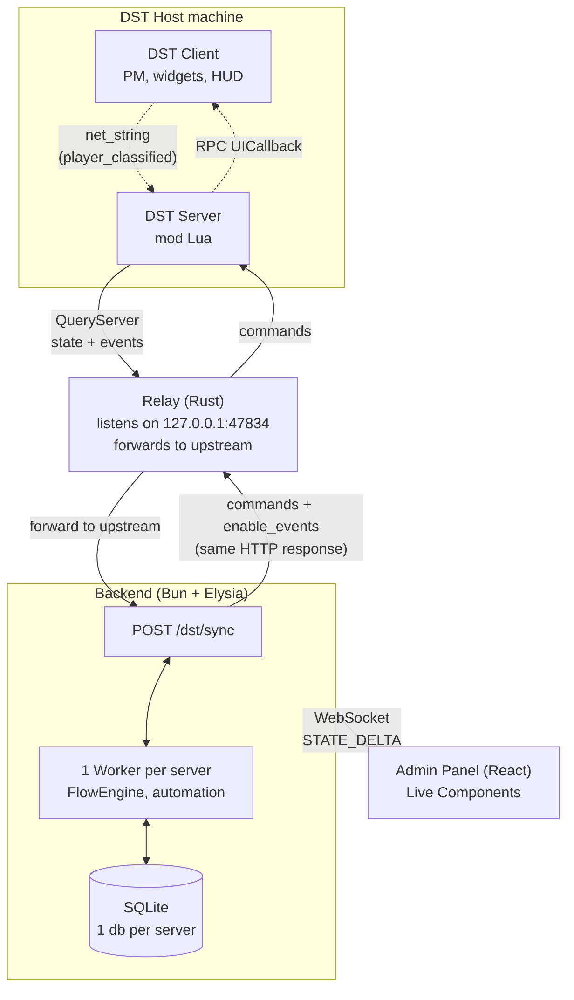

<div align="center">

# 🎮 DSTP — Don't Starve Together Panel

**Web admin panel + visual automation engine for Don't Starve Together servers.**

Manage players, world and chat, build automations with visual flows, and create **in-game UI** — all from the browser.

`Bun` · `Elysia` · `React 19` · `React Flow` · `SQLite / Drizzle` · `DST Lua mod`

</div>

---

## ✨ What it is

DSTP connects a **Lua mod** running on the DST server to a **full-stack web panel**. The mod polls over HTTP (the only networking the DST sandbox allows), sending game state and events; the backend replies with commands. On top of that, a **visual flow editor** (n8n-style) lets you automate server logic without writing code — and even **draw interfaces that show up on players' screens**.

> **It is NOT** a mod compiler. Flows run on the backend and send commands/UI to the game. It's a control + automation panel, not Lua generation.

## 🏗 Architecture



> The **relay** sits between the game and the backend because the DST Lua sandbox
> only lets `TheSim:QueryServer` reach `127.0.0.1`/`localhost`. The relay listens
> on loopback and forwards to the backend (local in dev, remote in prod) — that's
> what makes one central backend serve many DST hosts.

- **DST sandbox:** `TheSim:QueryServer` only allows `127.0.0.1`/`localhost`. To host centrally (one backend, many servers), each host runs the **relay** (a tiny ~2MB native Rust forwarder) that listens locally and forwards to the backend. The relay lives in a separate repo: [`dstp-relay`](https://github.com/MarcosBrendonDePaula/dstp-relay).
- **One worker per server:** each DST server processes its flows in a dedicated, isolated Bun Worker (see `WORKERS.md`).
- **Bidirectional in a single HTTP cycle:** the game POSTs state + events and gets commands back in the same response. No direct connection.

---

## 🚀 Features

### 🛠 Real-time administration
- Live state: players (vitals, position, inventory, age, admin), world (day/phase/season), multi-shard (overworld + caves grouped into tabs)
- **60+ command actions**: heal, feed, godmode, kick, ban, respawn, give/remove item, teleport, set_phase/season, skip_day, rollback, regenerate, lightning, spawn, entity read/control…
- Private messages and announcements; chat captured in real time
- **Per-server auth** (password + sessions; in-game magic-link via `#panel`)

### ⚡ Visual automation (flows)
n8n-style drag-and-drop editor. **11 node types**, **88 triggers**, **60+ actions**.

- **Triggers** across 14 categories: players, chat, combat, crafting, inventory, health, gathering, world, weather, bosses, survival, character, exploration, **creatures**, ui, **economy**
- **Nodes:** trigger · condition · action · delay · http_request · set_variable · **script (JS via Monaco)** · get_player · find_player · memory (persistent SQLite) · wait/merge
- **n8n-style context:** `{{node.field}}` / `{{alias.field}}`, deep-path resolution, types preserved
- **Capture/debug** per-node traces; **auto-activation** of event categories when a flow needs them
- **Stateful Wait/Merge:** multi-branch correlation with timeout
- **Encrypted Environments vault** for secrets (API keys/tokens), referenced as `{{environment.ENV.KEY}}` / `{{env.KEY}}`

### 🖥 In-game UI — *built by flows*
- **🎨 UI Builder** — assemble the whole interface **in a single node**, with a visual tree editor (clean canvas)
- **Generic client-side renderer** with **auto-layout**: panel, column, row, **tabs**, text, **real item icon**, image, button, progress bar, spacer, **text input**
- **`ui_set`** — update **any property** of any node in real time, without redrawing (balance, health bar, show/hide)
- **Click any widget** (text/icon/image/button) → becomes a `ui_callback` trigger in the flow
- **Draggable windows** (`panel draggable=true`) and an **editable text field** (Enter returns the typed value to the flow) — all validated on the real engine
- Client-side **tabs** (switch with no round-trip) and **follow-entity** (a HUD that tracks a mob/boss in the world)
- Declarative **rules engine**: reactive local HUD (live HP bar) with no backend round-trip

### 🐾 Entity events & control — *non-player mobs, structures, world objects*
Beyond per-player events, flows can react to and control **any entity** the game spawns.

- **14 entity triggers** (+ a `creatures` category): structure built/worked/ignited, container opened/looted, rift closed, nightmare phase, beefalo tamed/feral, mob transform/frozen, resource picked, mount rider changed…
- **Control actions keyed by GUID** (from an event) or prefab+position: `get_entity` (read any component — health, fuel, fire, container contents…), set health / kill / extinguish / ignite / set fuel / freeze, and **spawn returns the GUID** so a flow can spawn → control → react. See `specs/entity-control-catalog.md`.

### 🔗 Bindings — server-only data on the client
DST does **not** replicate data like mob health to the client. The **bindings** system adds its own netvars to ship server-only data to the client — generic and safe (curated catalog, gated by prefab).

- Today: **mob health** → real HP bar above creatures, dropping as they take damage
- Adding new data = one config entry (source + binding), no logic changes

### 🎒 Inventory & economy
- Full kit: count · has · give · equip · unequip · drop · clear · **remove N of prefab (atomic)** · transfer · dump_inventory
- Complete **example shop**: buy/sell with **real icons**, tabs, **live balance**, per-item inventory count, atomic debit of a real item **or** virtual currency (memory)

---

## 🏁 Getting started

```bash
# panel + backend (port 3000)
cd frontend && bun install && bun run dev

# type-check / migrations
cd frontend && bunx tsc --noEmit
cd frontend && bun run db:generate   # generate migration from schema
cd frontend && bun run db:studio     # database GUI

# copy the mod into the DST folder (after changing Lua)
cp DST_MOD/scripts/dstp/*.lua "<DST>/mods/DSTP/scripts/dstp/"
cp DST_MOD/modinfo.lua DST_MOD/modmain.lua "<DST>/mods/DSTP/"
```

Enable it in `modoverrides.lua`:
```lua
["DSTP"] = { enabled = true, configuration_options = {
    SERVER_ID = "auto",
    POLL_INTERVAL = 0.5,   -- 0.1 to 30s (the relay allows sub-second)
    EVT_PLAYERS = true, EVT_CHAT = true, EVT_WORLD = true,
    -- other categories OFF by default; flows activate what they need
}},
```

Open `http://localhost:3000/?server=<SERVER_ID>` — the panel connects on its own once the server starts syncing.

---

## 🧪 Testing

Two layers, because the DST mod is Lua and some behavior only exists on the real engine:

**Automated (CI) — `cd frontend && bun run test:unit`.** The backend has a full suite,
plus a **fengari test kit** (`app/server/live/mod-test-kit.ts`) that runs the mod's REAL
Lua modules (core/commands/rules_engine/ui_widgets/…) under a Lua-in-JS interpreter with
a mocked `_G`. This tests mod *behavior* (event coalescing, debounce, the loop watchdog,
the UI tree) without a running game.

**In-game (admin-only chat commands)** — for what the fengari kit can't see (the engine's
input/focus hit-test, `debug.sethook` preemption, strict mode, net_string):

| Command | What it does |
|---------|--------------|
| `#selftest` | Runs assertions in the **live master sim** (coalescing, per-player debounce, loop watchdog, execute gate) and PMs a PASS/FAIL summary; full results in `server_log.txt` (`DSTP SELF-TEST`). |
| `#uitest` / `#uitest clear` | Spawns one of each HUD widget — label, bar, button, **clickable text/icon/image**, a **draggable panel** (drag the title bar, X closes), and an **editable text field** (type, Enter sends) — on the admin's screen; clicks/inputs log `UITEST CLICK`. Add `hit_debug=true` on a node to tint its clickable region. |

Both are gated to admins and never reach public chat. Each has a fengari **meta-test**
(`selftest-module.test.ts` / `uitest-module.test.ts`) that runs the real module so a
false in-game result or state leak is caught in CI first.

> Why both: the click fix for in-game text/icon/image (#16) passed every automated test
> yet failed on a real click — DST routes clicks by *focus* and only a focused widget
> whose entity wins the engine hit-test receives them. `#uitest` is what surfaced and
> then confirmed the fix.

---

## 📦 Structure

```
DST_MOD/                          # DST mod (Lua)
  modinfo.lua, modmain.lua        #   config, entrypoint, netvars, bindings
  scripts/dstp/
    client.lua                    #   HTTP bridge, ~40 commands, listeners (server-side)
    ui_widgets.lua                #   client-side UI renderer (tree + auto-layout + follow)
    rules_engine.lua              #   declarative when/do rules (reactive on the client)
    selftest.lua · uitest.lua     #   in-game test runners (#selftest / #uitest, admin-only)
  specs/                          #   non-obvious technical knowledge — READ before changing
frontend/                         # FluxStack app (Bun + Elysia + React 19)
  app/server/live/                #   LiveDSTP, LiveAutomation, FlowEngine, ServerCoreManager
  app/server/live/mod-test-kit.ts #   run the mod's REAL Lua under fengari (behavioral tests)
  app/server/db/                  #   Drizzle schema, repositories, migrations (1 db per server)
  app/client/src/automation/      #   React Flow editor, nodes, UI Builder
# (the relay lives in a separate repo: github.com/MarcosBrendonDePaula/dstp-relay)
examples/flows/                   # example .dstp.json flows
docs/                             # AUTOMATION.md, WORKERS.md, IDEAS.md
```

## 🧰 Stack

| Layer | Tech |
|-------|------|
| Mod | Lua 5.1 (DST sandbox) — HTTP via `TheSim:QueryServer` |
| Backend | Bun + Elysia + FluxStack Live Components |
| Database | SQLite (`bun:sqlite`) + Drizzle ORM (1 db per server) |
| Frontend | React 19 + Vite + Tailwind |
| Flow editor | React Flow (xyflow) · Monaco for code |

## 📚 Documentation

| Doc | Contents |
|-----|----------|
| `CLAUDE.md` | Overview, architecture, project rules |
| `docs/AUTOMATION.md` · `docs/WORKERS.md` | Automation engine · per-server workers |
| `docs/IDEAS.md` | Full list of future ideas |
| `DST_MOD/specs/dst-client-constraints.md` | **Read before touching UI/networking** — what the DST client sees/doesn't, netvar pitfalls |
| `DST_MOD/specs/ui-by-nodes.md` · `ui-system.md` | UI by flows and the widget-tree contract |
| `DST_MOD/specs/dynamic-data-bindings.md` · `data-catalog.md` | Bindings system and which data is worth replicating |
| `DST_MOD/specs/entity-events-catalog.md` · `entity-control-catalog.md` | Entity triggers and GUID-keyed read/control actions |
| `DST_MOD/specs/dynamic-content-feasibility.md` · `http-prefab-transport.md` | What can/can't be added at runtime (assets are Workshop-only) |

---

## 🗺 Roadmap

### ✅ Done
- Real-time admin panel, multi-shard, per-server auth
- n8n-style automation engine: 11 nodes, capture/debug, stateful Wait/Merge
- Isolated worker per server; relay with auto-reconnect
- **UI by flows**: UI Builder, generic renderer, `ui_set`, tabs, follow-entity
- Buy/sell **shop** with icons, live balance, real inventory
- **Bindings**: mob health replicated to the client (real HP bar)
- Live player HUD (position, vitals, coins, day)
- **Encrypted Environments vault** for flow secrets
- **Entity events + control**: 14 non-player triggers, GUID-keyed read/mutate actions (validated in-game)

### 🔜 Next (clear path)
- **Bindings authoring UI** — declare data to replicate from the panel, no Lua editing
- **More catalog sources** (on demand, only when a UI consumes them): other players' health, campfire fuel, crockpot/plant timers, food freshness
- **Switch/Router, Loop, Aggregator nodes** — more expressive flows (`IDEAS.md`)
- Server performance monitoring in the panel
- Light mode · mobile responsive · multi-language

### 🔮 Future / exploratory
- **Plugin system** — packages that register triggers, actions, panels and Live Components; auto-discovery in `plugins/`
- Ready-made plugins: Economy · Voting · Auto-Ban (anti-grief) · Boss Timer · Welcome Kit · Scheduler · Stats Dashboard
- **2D world map** in the browser with live player positions
- Multi-user with permissions (admin/moderator/viewer), audit log, public REST API
- Docker deploy, automatic DB backups, delta-sync / payload compression
- Drag-and-drop inventory, remote Lua console with autocomplete, click-to-spawn on the map

---

## ⚠️ Constraints worth knowing (summary)

- **HTTP only to `127.0.0.1`** (sandbox) → use the relay.
- **Mob health is not replicated** to the client natively → solved via bindings.
- **Netvars are positional** → always add them gated by `inst.prefab` (tags/replicas/components desync and crash). Details in `specs/dst-client-constraints.md`.

---

<div align="center">

Built for the DST community 🪓 — a panel the game doesn't ship with.

**License:** MIT

</div>
